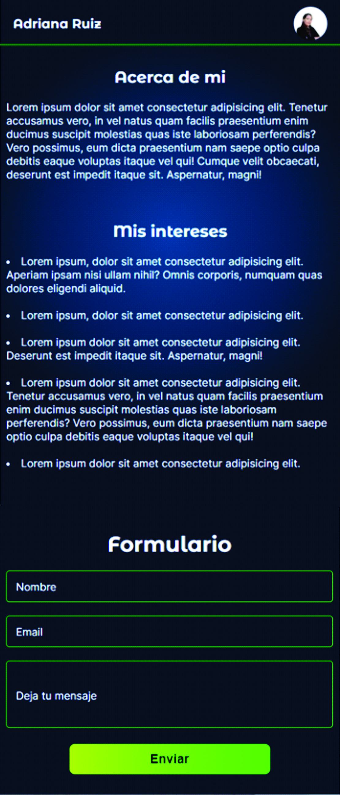

## Pasos para instalar y ejecutar el proyecto

1. Clonar el repositorio desde el CMD con el comando
```bash
git clone https://github.com/adrianamariaruiz/user-profile-app.git
```

2. Ubicado en la carpeta del proyecto se debe instalar las dependencias con el comando:
```bash
 npm install
```

3. Para abrir el proyecto desde la CMD en Visual Studio Code use el comando
```bash
code .
```

4. Para ejecutar el servidor de desarrollo desde la terminal de Visual Studio Code
```bash
npm run dev
```

5. Abra el [http://localhost:3000](http://localhost:3000) en su buscador para visualizar la página web.

## Para correr los Tests

Para correr los test abra la termianl de Visual Studio Code y use el comando 
```bash
npm test
```


## Informacion del proyecto

### Imagenes de referencia de la página realizada

<div>
  
  
  
  
</div>


### Proyecto realizado con: Next.js 14, TypeScript, CSS Modules, Jest, Testing Library
### Desarrollado por: Adraiana Ruiz


